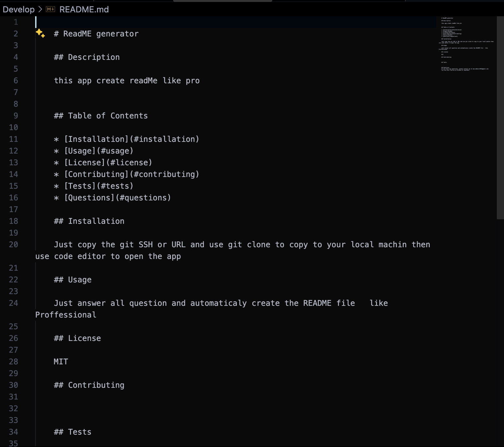

# Professional README Generator 

# Introduction

This project aims to simplify the process of creating README files for various projects. It utilizes Node.js modules and interactive prompts to gather project information and generate a structured README file.

# Setup

Before running the application, ensure that Node.js is installed on your system. Follow these steps to set up the project:

1-Clone the repository to your local machine.
2-Navigate to the project directory using the command line.
3-Install dependencies by running npm install.

# Usage

To generate a README file for your project, follow these steps:

1-Run the application using the command: node index.js.
2-You will be prompted to provide details about your project, such as title, description, installation steps, usage instructions, etc.
3-Once you have provided all the necessary information, a README file (README.md) will be generated in the project directory.

# Contact Information

If you have any questions, feedback, or suggestions regarding this project, feel free to contact:

Email: [moe.abbasi1983@gmail.com]
GitHub: moe1362

# License
This project is licensed under the MIT. See the LICENSE file for more details.

